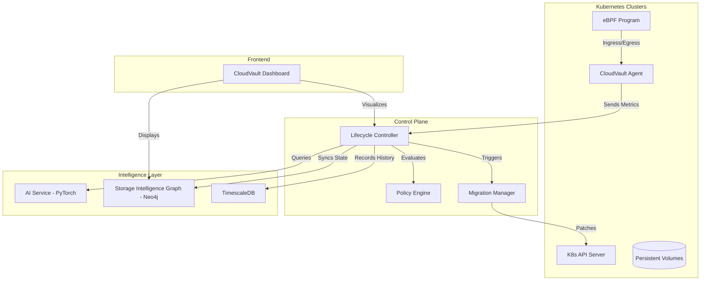
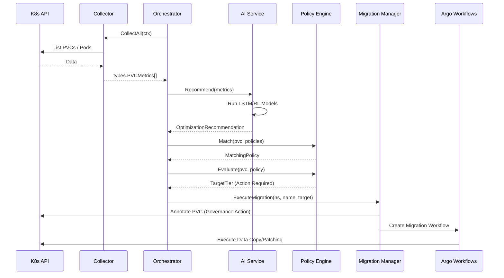
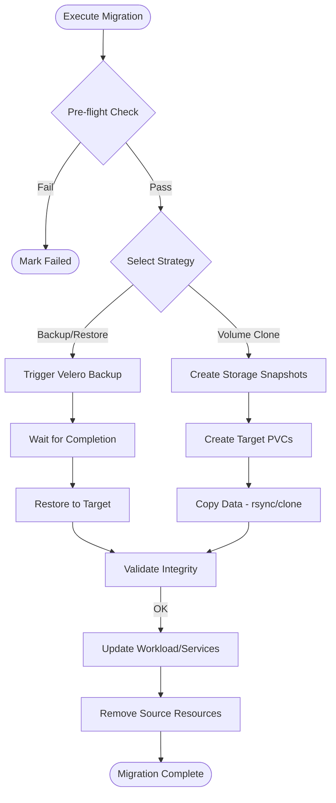

# 🏗️ CloudVault Architecture

CloudVault is an autonomous, AI-driven storage cost optimization platform for Kubernetes. It implements a multi-layered architecture that combines kernel-level monitoring (eBPF), graph-based relationship mapping (SIG), and deep learning (LSTM/RL) to provide proactive storage governance.

---

## 🛰️ High-Level Architecture

The system is organized into three distinct layers:

1.  **Data Plane (Collectors & eBPF)**: Distributed agents running as DaemonSets that harvest raw storage and network telemetry.
2.  **Control Plane (Orchestrator & Policy Engine)**: The central brain that evaluates state against desired policies and coordinates actions.
3.  **Intelligence Layer (AI & SIG)**: Specialized microservices that provide predictive insights and relationship analytics.

### System Components Diagram

```mermaid
graph TB
    subgraph "Kubernetes Clusters"
        Agent[CloudVault Agent]
        K8S_API[K8s API Server]
        eBPF[eBPF Program]
        PVCs[(Persistent Volumes)]
    end

    subgraph "Control Plane"
        Orch[Lifecycle Controller]
        Policy[Policy Engine]
        Mgr[Migration Manager]
    end

    subgraph "Intelligence Layer"
        AI[AI Service - PyTorch]
        SIG[Storage Intelligence Graph - Neo4j]
        TSDB[TimescaleDB]
    end

    subgraph "Frontend"
        Dash[CloudVault Dashboard]
    end

    Agent -- Sends Metrics --> Orch
    eBPF -- Ingress/Egress --> Agent
    Orch -- Syncs State --> SIG
    Orch -- Records History --> TSDB
    Orch -- Queries --> AI
    Orch -- Evaluates --> Policy
    Orch -- Triggers --> Mgr
    Mgr -- Patches --> K8S_API
    Dash -- Visualizes --> Orch
    Dash -- Displays --> SIG
```

---

## 🔁 Operational Flow Sequence

CloudVault operates in a continuous "Sense-Think-Act" loop.

### 1. Data Collection (Sense)
*   **eBPF Agent**: Attaches to network interfaces to attribute egress traffic to specific PVCs by mapping IP traffic to Pod/PVC relationships.
*   **Kubernetes Collector**: Scrapes PVC utilization, provisioning metadata, and cloud provider pricing (AWS/GCP/Azure).

### 2. Analysis & Recommendation (Think)
*   **Storage Intelligence Graph (SIG)**: Maps Pod-to-PVC locality to detect "Data Gravity" issues (e.g., a Pod in `us-east-1` accessing a PVC in `us-east-2`).
*   **AI Forecaster (LSTM)**: Analyzes historical growth patterns in TimescaleDB to predict when a volume will run out of space or become a "Zombie".
*   **Placement Agent (RL)**: Uses Reinforcement Learning to decide the optimal storage tier based on performance/cost trade-offs.

### 3. Governance & Migration (Act)
*   **Policy Engine**: Matches recommendations against `StorageLifecyclePolicies`.
*   **Migration Manager**: Executes non-disruptive migrations using Argo Workflows or direct volume cloning strategies.

---

## 🧪 Sequence Diagram: Optimization Loop

This diagram illustrates the lifecycle of a single optimization recommendation, from detection to execution.

```mermaid
sequenceDiagram
    participant K as K8s API
    participant C as Collector
    participant O as Orchestrator
    participant AI as AI Service
    participant P as Policy Engine
    participant M as Migration Manager
    participant A as Argo Workflows

    O->>C: CollectAll(ctx)
    C->>K: List PVCs / Pods
    K-->>C: Data
    C-->>O: types.PVCMetrics[]

    O->>AI: Recommend(metrics)
    AI->>AI: Run LSTM/RL Models
    AI-->>O: OptimizationRecommendation

    O->>P: Match(pvc, policies)
    P-->>O: MatchingPolicy

    O->>P: Evaluate(pvc, policy)
    P-->>O: TargetTier (Action Required)

    O->>M: ExecuteMigration(ns, name, target)
    M->>K: Annotate PVC (Governance Action)
    M->>A: Create Migration Workflow
    A->>K: Execute Data Copy/Patching
```

---

## 🛠️ Low-Level Component Details

### 1. CloudVault Agent (Data Plane)
*   **eBPF Bytecode**: Custom C programs compiled to eBPF bytecode, loaded into the kernel to monitor `tc` (traffic control) hooks.
*   **Prometheus Exporter**: Serves metrics on `:9090` for scraping.
*   **Cost Calculator**: Embedded logic for calculating "Effective Cost" by blending provisioning price with egress overhead.

### 2. Lifecycle Controller (Control Plane)
*   **ProcessOptimization**: The core loop running every `N` minutes.
*   **SyncPodRelationships**: Discovers which pods are using which PVCs to build the SIG gravity map.
*   **Migration Executor**: Handles the complex logic of patching workloads during storage moves.

### 3. AI Service (Intelligence Layer)
*   **LSTM Model**: Implemented in PyTorch, specifically tuned for time-series forecasting of sparse billing data.
*   **RL Agent**: Uses Q-Learning to optimize "Placement Reward" (Max Performance / Min Cost).

---

## 📈 Detailed Flow Chart: Migration Execution

```mermaid
flowchart TD
    Start([Execute Migration]) --> PreCheck{Pre-flight Check}
    PreCheck -- Fail --> Error([Mark Failed])
    PreCheck -- Pass --> Strategy{Select Strategy}
    
    Strategy -- Backup/Restore --> Velero[Trigger Velero Backup]
    Strategy -- Volume Clone --> Snap[Create Storage Snapshots]
    
    Velero --> WaitV[Wait for Completion]
    Snap --> TargetPVC[Create Target PVCs]
    
    WaitV --> Restore[Restore to Target]
    TargetPVC --> DataCopy[Copy Data - rsync/clone]
    
    Restore --> Valid[Validate Integrity]
    DataCopy --> Valid
    
    Valid -- OK --> Patch[Update Workload/Services]
    Patch --> Cleanup[Remove Source Resources]
    Cleanup --> End([Migration Complete])
```
