# CloudVault Architecture (Sandbox Graduation Vision)

## High-Level Overview

CloudVault is an enterprise-grade storage orchestrator featuring autonomous intelligence and kernel-level visibility.

```mermaid
graph TD
    User[User / CLI] -->|Control| Dash[Dashboard Server]
    Dash -->|Policies| Orchestrator[Lifecycle Orchestrator]
    Orchestrator -->|Placement| K8s[Kubernetes API]
    
    subgraph "Deep Tech Layer"
        SIG[(Neo4j SIG Graph)]
        AI[AI Decision Layer: LSTM/RL]
        Agent[eBPF Traffic Agent]
    end
    
    subgraph "Collector Core"
        PVCColl[PVC Collector]
        EgressColl[Egress Provider]
    end
    
    PVCColl --> SIG
    EgressColl -->|Kernel Stats| SIG
    Agent -->|Egress Data| EgressColl
    SIG --> AI
    AI -->|Insights| Dash
    AI -->|Decisions| Orchestrator
```

## Core Components

### 1. eBPF Zero-Overhead Agent
-   **Kernel Monitoring**: Monitors `socket` events to attribute egress traffic to specific workloads.
-   **Zero-Overhead**: Eliminates the need for heavy sidecars or manual instrumentation.

### 2. Storage Intelligence Graph (SIG)
-   **Neo4j Backed**: Stores multi-dimensional relationships between Pods, PVCs, Nodes, and Regions.
-   **Gravity Detection**: Identifies workloads pulled into high-cost zones by storage dependencies.

### 3. AI-Powered Decision Layer
-   **LSTM Cost Forecaster**: Predicts spend trends to prevent "Sticker Shock".
-   **RL Placement Engine**: Uses Reinforcement Learning to optimize storage tiering based on learned workload patterns.

### 4. Enterprise Scaling (Phase 9)
-   **Adaptive Worker Pools**: Collector scales concurrency based on PVC count.
-   **Batched Processing**: High-throughput graph updates using transaction unwind patterns.
-   **Health Observability**: Integrated `/healthz` and `/readyz` probes for Kubernetes.

## Data Flow: Metrics Collection & Optimization

1.  **Collection**: The `PVCCollector` queries the Kubernetes API for PVC metadata. Worker pools scale dynamically based on cluster size.
2.  **Egress Attribution**: eBPF-derived egress data is correlated with PVCs once per cycle to reduce kernel overhead.
3.  **Graph Sync**: Metrics are pushed to the SIG in batch transactions for complex relationship analysis.
4.  **AI Inference**: The Decision Layer processes graph state to generate predictive placements.
